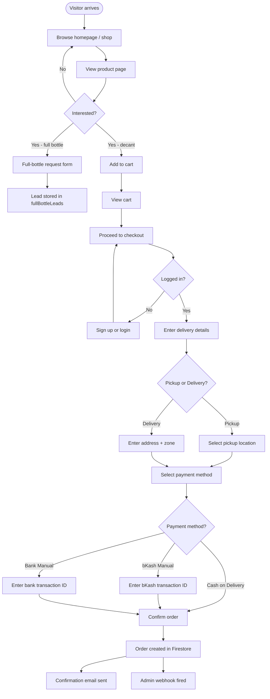
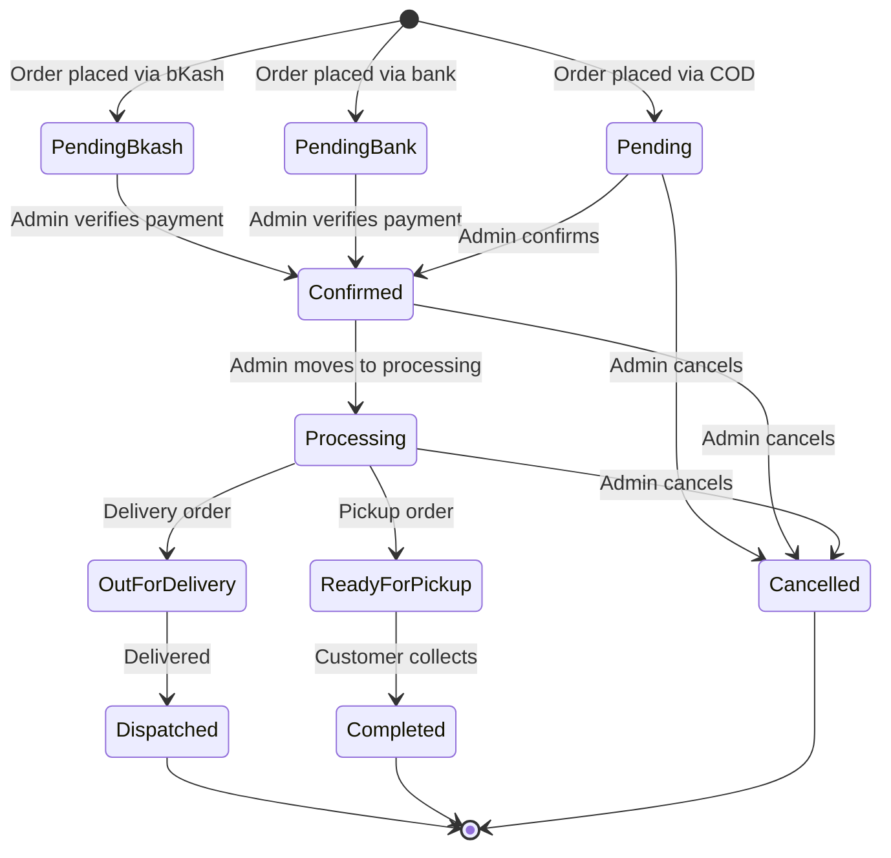
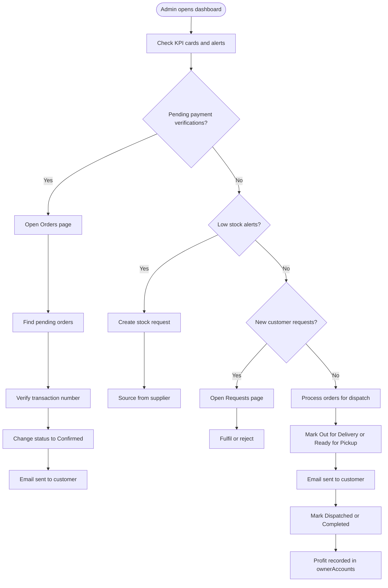
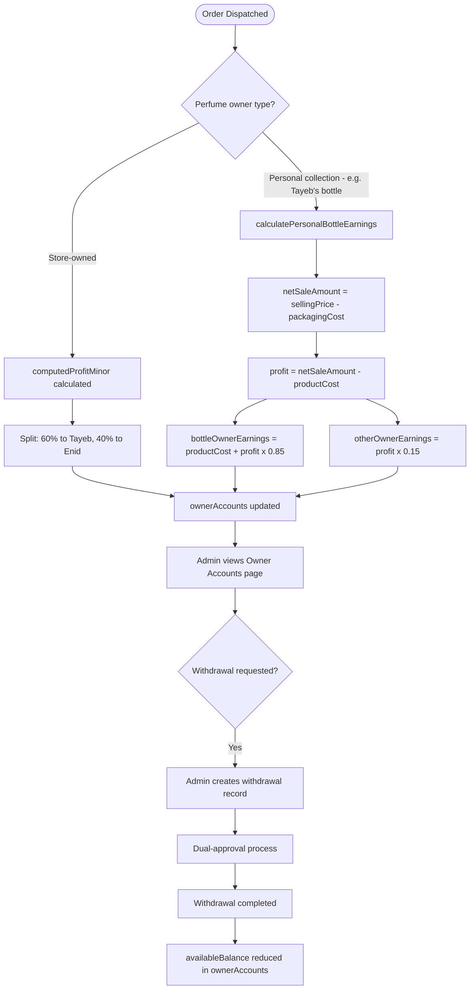

# Valore Parfums — Production README

> **Audience:** New CTOs rebuilding the system and business owners understanding every feature without opening source code.
> **Basis:** Every section is derived exclusively from code evidence. "Not implemented" is written where no code evidence exists.

---

## Table of Contents

1. [Project Overview](#1-project-overview)
2. [Tech Stack](#2-tech-stack)
3. [Feature Inventory](#3-feature-inventory)
4. [Firebase Architecture](#4-firebase-architecture)
5. [API Documentation](#5-api-documentation)
6. [Business Logic](#6-business-logic)
7. [SEO System](#7-seo-system)
8. [Performance Optimisations](#8-performance-optimisations)
9. [Security Audit](#9-security-audit)
10. [Environment Variables](#10-environment-variables)
11. [File Structure](#11-file-structure)
12. [User Flows](#12-user-flows)
13. [Hidden Features](#13-hidden-features)
14. [Technical Debt](#14-technical-debt)
15. [Statistics](#15-statistics)

---

## 1. Project Overview

| Field                | Value                                                                                                                                                                                                                                                                     |
| -------------------- | ------------------------------------------------------------------------------------------------------------------------------------------------------------------------------------------------------------------------------------------------------------------------- |
| **Name**             | Valore Parfums                                                                                                                                                                                                                                                            |
| **Domain**           | www.valoreparfums.app                                                                                                                                                                                                                                                     |
| **Business Purpose** | Online perfume decant store serving the Bangladesh market. Customers sample luxury and niche fragrances in small sizes (3 ml–30 ml) before committing to full bottles.                                                                                                    |
| **Target Users**     | Fragrance buyers in Bangladesh (customers); two co-owners who manage inventory, orders, and finances (admin).                                                                                                                                                             |
| **Business Model**   | Direct-to-consumer e-commerce. Revenue from decant sales + markup over cost. Profit split between two named owners. Full-bottle sourcing on request (lead capture).                                                                                                       |
| **Architecture**     | Monorepo with two independent Next.js applications: `frontend/` (customer storefront + admin panel, deployed on Netlify) and `backend/` (JSON API server, deployed on Render.com). The frontend proxies every `/api/*` call to the backend via a catch-all route handler. |

### Architecture Diagram

```
Browser
  │
  ▼
frontend/ (Netlify, port 3000)
  ├── Storefront pages (SSR/ISR)
  ├── Admin panel (SSR, role-gated)
  └── /api/[...path] → proxy → backend/ (Render, port 3001)
                                    │
                                    ├── Firestore (Google Cloud)
                                    ├── Cloudinary (image storage)
                                    └── Gmail SMTP (email)
```

### Development

Install dependencies per app:

```
npm --prefix backend install
npm --prefix frontend install
```

Run apps independently:

- Backend: `cd backend && npm run dev` (http://localhost:3001)
- Frontend: `cd frontend && npm run dev` (http://localhost:3000)

Frontend API calls are proxied to backend via `NEXT_PUBLIC_API_BASE_URL`.

---

## 2. Tech Stack

| Layer                  | Technology                               | Version / Notes                                                          |
| ---------------------- | ---------------------------------------- | ------------------------------------------------------------------------ |
| **Frontend framework** | Next.js                                  | 16.1.6, App Router                                                       |
| **Backend framework**  | Next.js (API-only)                       | 16.1.6, App Router                                                       |
| **Runtime**            | React 19 / Node.js                       | React 19.2.3                                                             |
| **Language**           | TypeScript                               | v5                                                                       |
| **Database**           | Cloud Firestore (Firebase Admin SDK)     | firebase-admin 13.7.0                                                    |
| **Auth**               | Custom session-based auth                | PBKDF2 + HMAC-signed cookies; Google OAuth via Firebase Auth             |
| **Storage / Images**   | Cloudinary                               | v2.9.0 via cloudinary SDK                                                |
| **Email**              | Nodemailer → Gmail SMTP                  | nodemailer 8.0.4; SMTP via Gmail app password                            |
| **Hosting — Frontend** | Netlify                                  | @netlify/plugin-nextjs                                                   |
| **Hosting — Backend**  | Render.com                               | Node web service                                                         |
| **Styling**            | Tailwind CSS v4                          | CSS variable-based theming                                               |
| **State management**   | Zustand v5                               | Cart store + Auth store + Theme store                                    |
| **Charts**             | Recharts v3                              | Admin dashboard only, dynamically imported                               |
| **Image optimisation** | Next.js Image + Sharp                    | AVIF/WebP output, 30-day cache                                           |
| **Analytics**          | Not implemented                          | No analytics library found in code                                       |
| **Search**             | Not implemented                          | No dedicated search service; `/api/perfumes/search` is a Firestore query |
| **Caching**            | In-memory Map + Next.js `unstable_cache` | Per-process; see §8                                                      |
| **Fonts**              | Google Fonts                             | Cormorant Garamond (serif), DM Sans (sans), JetBrains Mono (mono)        |

### Firestore Collections (summary)

`perfumes`, `perfumeReviews`, `notesLibrary`, `decantSizes`, `bottles`, `settings`, `bulkPricingRules`, `orders` (+`items` subcollection), `vouchers`, `stockRequests`, `users`, `wishlists`, `notifications`, `withdrawals`, `pickupLocations`, `requests`, `fullBottleLeads`, `blogPosts`, `ownerAccounts`, `profitTransactions`, `auditLogs`

---

## 3. Feature Inventory

### 3.1 Authentication

| Name                   | Description                                                                                      | User           | Files                                                                             | Business Purpose          |
| ---------------------- | ------------------------------------------------------------------------------------------------ | -------------- | --------------------------------------------------------------------------------- | ------------------------- |
| Email/password sign-up | Registers customer, hashes password with PBKDF2, creates `users` doc, sets signed session cookie | Customer       | `backend/src/app/api/auth/signup/route.ts`, `backend/src/lib/auth.ts`             | New customer onboarding   |
| Email/password login   | Verifies PBKDF2 hash, auto-upgrades legacy SHA-256 hashes, sets session cookie                   | Customer/Admin | `backend/src/app/api/auth/login/route.ts`                                         | Returning customer access |
| Google OAuth login     | Verifies Firebase ID token, upserts user in Firestore, sets session cookie                       | Customer       | `backend/src/app/api/auth/google/route.ts`, `frontend/src/lib/firebase-client.ts` | Frictionless sign-in      |
| Session management     | HMAC-SHA256 signed JSON cookie (`vp-session`), 30-day TTL, `httpOnly`, `SameSite=strict`         | All            | `backend/src/lib/auth.ts`                                                         | Persistent login          |
| Logout                 | Clears `vp-session` cookie                                                                       | All            | `backend/src/app/api/auth/logout/route.ts`                                        | Session termination       |
| Current user           | Returns session user if cookie is valid                                                          | All            | `backend/src/app/api/auth/me/route.ts`                                            | Client-side hydration     |
| Profile update         | Updates `name`, `phone` fields on `users` doc                                                    | Customer       | `backend/src/app/api/auth/profile/route.ts`                                       | Account management        |
| Rate limiting          | 5 auth attempts per 15 minutes per IP                                                            | All            | `backend/src/lib/rate-limit.ts`                                                   | Brute force protection    |

### 3.2 Storefront

| Name                   | Description                                                                                                              | User     | Files                                                                                 | Business Purpose         |
| ---------------------- | ------------------------------------------------------------------------------------------------------------------------ | -------- | ------------------------------------------------------------------------------------- | ------------------------ |
| Homepage               | Hero + best-sellers (sorted by `totalOrders`) + new arrivals; ISR revalidate 300 s                                       | Customer | `frontend/src/app/(store)/page.tsx`                                                   | Discovery and conversion |
| Shop / product listing | Full product grid with filtering; reads `perfumes` collection                                                            | Customer | `frontend/src/app/(store)/shop/ShopContent.tsx`                                       | Browse and buy           |
| Product detail page    | SEO-optimised page at `/products/[slug]`; schema.org `Product` JSON-LD, price variants, reviews, full-bottle request CTA | Customer | `frontend/src/app/(store)/products/[slug]/page.tsx`                                   | Primary conversion page  |
| Legacy product page    | `/perfume/[id]` — ID-based fallback route                                                                                | Customer | `frontend/src/app/(store)/perfume/[id]/page.tsx`                                      | Backward compatibility   |
| Category pages         | `/category/decants` and `/category/full-bottles`                                                                         | Customer | `frontend/src/app/category/`                                                          | Faceted discovery        |
| Brand pages            | `/brand/[brandSlug]` — products filtered by brand                                                                        | Customer | `frontend/src/app/brand/`                                                             | Brand-led discovery      |
| Cart                   | Client-side cart persisted to `localStorage` via Zustand `persist`; decant + full-bottle items                           | Customer | `frontend/src/store/cart.ts`                                                          | Pre-purchase             |
| Checkout               | Delivery details, pickup vs delivery toggle, payment method selection, voucher code entry                                | Customer | `frontend/src/app/(store)/checkout/page.tsx`                                          | Order placement          |
| Wishlist               | Add/remove perfumes; persisted to `wishlists` collection per user                                                        | Customer | `frontend/src/app/(store)/wishlist/page.tsx`, `backend/src/app/api/wishlist/route.ts` | Deferred purchase intent |
| Order tracking         | Customer views own orders and statuses at `/track`                                                                       | Customer | `frontend/src/app/(store)/track/page.tsx`                                             | Post-purchase experience |
| Reviews                | Star rating + comment per perfume; stored in `perfumeReviews`; public read, anonymous write                              | Customer | `backend/src/app/api/reviews/route.ts`                                                | Social proof             |
| Full-bottle request    | Lead capture form; stores to `fullBottleLeads`                                                                           | Customer | `backend/src/app/api/full-bottle-requests/route.ts`                                   | Upsell pipeline          |
| Customer requests      | Sourcing request page; creates entry in `requests`                                                                       | Customer | `frontend/src/app/(store)/requests/page.tsx`, `backend/src/app/api/requests/route.ts` | Demand-driven sourcing   |
| Blog                   | Static content pages at `/blog/[postSlug]`                                                                               | Customer | `frontend/src/app/blog/`, `frontend/src/lib/seo-content.ts`                           | SEO content              |
| Notifications/banners  | Active store announcements fetched from `notifications` collection                                                       | Customer | `backend/src/app/api/notifications/route.ts`                                          | Operational messaging    |
| Theme                  | Dark/light preference stored via `ThemeInitializer`                                                                      | Customer | `frontend/src/components/ThemeInitializer.tsx`, `frontend/src/store/theme.ts`         | UI preference            |

### 3.3 Product Management (Admin)

| Name                     | Description                                                                                                  | User  | Files                                                                                   | Business Purpose        |
| ------------------------ | ------------------------------------------------------------------------------------------------------------ | ----- | --------------------------------------------------------------------------------------- | ----------------------- |
| Perfume CRUD             | Create, read, update, delete perfume documents; sets `slug`, `brandSlug`, `isActive`, `totalStockMl`, images | Admin | `backend/src/app/api/perfumes/route.ts`, `backend/src/app/api/perfumes/[id]/route.ts`   | Catalogue management    |
| Image upload             | Upload product images to Cloudinary; returns CDN URL stored on perfume doc                                   | Admin | `backend/src/app/api/uploads/perfume-image/route.ts`, `backend/src/lib/cloudinary.ts`   | Product media           |
| Inventory page           | Lists all perfumes with stock levels                                                                         | Admin | `frontend/src/app/admin/inventory/page.tsx`                                             | Stock visibility        |
| Decant size config       | Enable/disable available ml sizes; stored in `decantSizes`                                                   | Admin | `backend/src/app/api/decant-sizes/route.ts`, `frontend/src/app/admin/decant-sizes/`     | Offering management     |
| Bottle inventory         | Track atomiser/bottle stock by ml size; stored in `bottles`                                                  | Admin | `backend/src/app/api/bottles/route.ts`, `frontend/src/app/admin/bottles/`               | Supply management       |
| Notes library            | Canonical fragrance notes reference; stored in `notesLibrary`                                                | Admin | `backend/src/app/api/notes-library/route.ts`                                            | Data integrity          |
| Brand sections           | Configure which brands appear in UAE/niche/designer sections; stored in `settings`                           | Admin | `backend/src/app/api/brand-sections/route.ts`, `frontend/src/app/admin/brand-sections/` | Storefront curation     |
| Personal collection flag | Mark a perfume as `isPersonalCollection`; triggers different profit formula                                  | Admin | `backend/scripts/set-personal-collection.ts`, `backend/src/lib/ownerEarnings.ts`        | Owner earnings tracking |

### 3.4 Order System

| Name                   | Description                                                                                                                                                                          | User           | Files                                                                                   | Business Purpose             |
| ---------------------- | ------------------------------------------------------------------------------------------------------------------------------------------------------------------------------------ | -------------- | --------------------------------------------------------------------------------------- | ---------------------------- |
| Order creation         | POST to `/api/orders`; validates cart, calculates pricing snapshot, deducts stock, triggers confirmation email + admin webhook                                                       | Customer       | `backend/src/app/api/orders/route.ts`                                                   | Core transaction             |
| Order status flow      | Statuses: Pending → Confirmed / Pending Bkash Verification / Pending Bank Verification → Processing/Paid → Ready for Pickup or Out for Delivery → Dispatched/Completed → (Cancelled) | Admin/Customer | `backend/src/lib/orderStatusConfig.ts`                                                  | Fulfilment tracking          |
| Admin order management | View all orders, update status, verify payment, add notes, cancel with reason                                                                                                        | Admin          | `frontend/src/app/admin/orders/page.tsx`, `backend/src/app/api/orders/[id]/route.ts`    | Fulfilment operations        |
| Payment verification   | Admin manually confirms bKash or bank transfer by checking transaction number                                                                                                        | Admin          | `backend/src/app/api/orders/[id]/verify-payment/route.ts`                               | Manual payment flow          |
| Order cancellation     | Admin cancels order with selectable reason from `presetReasons`; sends cancellation email with refund status                                                                         | Admin          | `backend/src/app/api/orders/[id]/cancel/route.ts`, `backend/src/lib/email.ts`           | Exception handling           |
| My orders              | Customers view own order history, matched by `userId`, `placedByEmail`, or `customerEmail`                                                                                           | Customer       | `backend/src/app/api/orders/route.ts` (GET `?user=me`)                                  | Customer self-service        |
| Pickup method          | Orders flagged as `pickupMethod: "Pickup"` or `"Delivery"` with distinct email flows                                                                                                 | Both           | `backend/src/lib/orderStatusConfig.ts`                                                  | Dual fulfilment model        |
| Admin webhook alert    | POST to `ADMIN_ALERT_WEBHOOK_URL` on every new order with manual payment                                                                                                             | System         | `backend/src/app/api/orders/route.ts`                                                   | Real-time admin notification |
| Stock requests (admin) | Admin creates sourcing requests that become orders with `status: "Sourcing"`                                                                                                         | Admin          | `backend/src/app/api/stock-requests/route.ts`, `frontend/src/app/admin/stock-requests/` | Out-of-stock fulfilment      |

### 3.5 Earnings & Profit System

| Name                      | Description                                                                                                                                                                  | User   | Files                                                                       | Business Purpose          |
| ------------------------- | ---------------------------------------------------------------------------------------------------------------------------------------------------------------------------- | ------ | --------------------------------------------------------------------------- | ------------------------- |
| Pricing snapshot          | Immutable snapshot of pricing at order creation (`pricingVersion`, `subtotalMinor`, `discountMinor`, `deliveryFeeMinor`, `totalMinor`, `totalCostMinor`, `totalProfitMinor`) | System | `backend/src/lib/finance.ts`                                                | Audit trail               |
| Item-level breakdown      | Per line item: `unitCostMinor`, `unitSellingPriceMinor`, `totalCostMinor`, `totalRevenueMinor`, `computedProfitMinor`                                                        | System | `backend/src/lib/finance.ts`                                                | Granular profit tracking  |
| Store profit split        | Store-owned items: profit split by configured `owner1Share` (default 60%) / `owner2Share` (default 40%) between Tayeb and Enid                                               | System | `backend/src/lib/utils.ts`, `backend/src/lib/finance.ts`                    | Owner remuneration        |
| Personal collection split | Owner's bottle: owner recovers `productCost` first, then 85% of remaining profit; other owner gets 15%                                                                       | System | `backend/src/lib/ownerEarnings.ts`                                          | Personal bottle economics |
| Owner accounts            | Running balance per owner tracked in `ownerAccounts`; feeds withdrawal module                                                                                                | Admin  | `backend/src/app/api/owner-accounts/route.ts`                               | Financial accounting      |
| Withdrawals               | Record owner profit withdrawals with dual-approval workflow; stored in `withdrawals`; supports profit, revenue (COD), and expense types                                      | Admin  | `backend/src/app/api/withdrawals/route.ts`                                  | Cash management           |
| Profit transactions       | Immutable ledger entries in `profitTransactions`                                                                                                                             | System | `backend/src/app/api/owner-accounts/route.ts`                               | Financial audit log       |
| Dashboard metrics         | All-time, today, and month revenue/profit/order counts for both owners and store; `BarChart`, `LineChart`, `AreaChart`                                                       | Admin  | `frontend/src/app/admin/page.tsx`, `backend/src/app/api/dashboard/route.ts` | Business visibility       |
| Reports page              | Extended business analytics                                                                                                                                                  | Admin  | `frontend/src/app/admin/reports/page.tsx`                                   | Performance review        |

### 3.6 Customer Accounts

| Name               | Description                                             | User     | Files                                        |
| ------------------ | ------------------------------------------------------- | -------- | -------------------------------------------- |
| Registration       | Email + phone + password; rate-limited                  | Customer | `frontend/src/app/(store)/signup/page.tsx`   |
| Login / Google SSO | Email/password or Google popup                          | Customer | `frontend/src/app/(store)/login/page.tsx`    |
| Order history      | List of customer's own orders via `/api/orders?user=me` | Customer | `frontend/src/app/(store)/track/page.tsx`    |
| Wishlist           | Save fragrances for later                               | Customer | `frontend/src/app/(store)/wishlist/page.tsx` |
| Profile edit       | Update name and phone                                   | Customer | `backend/src/app/api/auth/profile/route.ts`  |

### 3.7 Admin Panel

| Page              | Path                      | Function                                                                                                          |
| ----------------- | ------------------------- | ----------------------------------------------------------------------------------------------------------------- |
| Dashboard         | `/admin`                  | KPI cards (orders, revenue, profit, today, month), charts, low-stock alerts, recent orders, owner balance summary |
| Inventory         | `/admin/inventory`        | Full perfume catalogue CRUD; toggle active/inactive; edit pricing fields                                          |
| Brand Sections    | `/admin/brand-sections`   | Assign brands to UAE/niche/designer groupings displayed on storefront                                             |
| Decant Sizes      | `/admin/decant-sizes`     | Enable/disable ml sizes available for purchase                                                                    |
| Bottles           | `/admin/bottles`          | Track atomiser bottle stock by ml capacity                                                                        |
| Orders            | `/admin/orders`           | View, filter, update status, verify payment, cancel, copy order ID                                                |
| Requests          | `/admin/requests`         | Manage customer sourcing requests; fulfil or reject                                                               |
| Vouchers          | `/admin/vouchers`         | Create and manage discount vouchers (% or fixed, usage limits, expiry)                                            |
| Pickup Locations  | `/admin/pickup-locations` | CRUD physical pickup points                                                                                       |
| Notifications     | `/admin/notifications`    | Create/toggle store announcement banners visible on storefront                                                    |
| Reports           | `/admin/reports`          | Business performance reports                                                                                      |
| Export            | `/admin/export`           | Download orders, items, or perfumes as CSV                                                                        |
| Settings          | `/admin/settings`         | Store settings: delivery fees, payment accounts (bKash/bank), tier margins, owner config, low-stock threshold     |
| (Global Settings) | via API only              | Pickup availability, prep time, cancellation preset reasons — managed via `/api/global-settings`                  |

### 3.8 Email System

| Template Function                 | Trigger                             | Recipient | Key Variables                                                                                                          |
| --------------------------------- | ----------------------------------- | --------- | ---------------------------------------------------------------------------------------------------------------------- |
| `generateOrderConfirmationEmail`  | Order placed (any payment method)   | Customer  | `orderId`, `customerName`, `customerEmail`, `items[]`, `subtotal`, `discount`, `deliveryFee`, `total`, `paymentMethod` |
| `generateOrderConfirmedEmail`     | Admin moves order to Confirmed/Paid | Customer  | `orderId`, `customerName`, `customerEmail`, `items[]`, `total`                                                         |
| `generateOrderDispatchedEmail`    | Admin dispatches order              | Customer  | `orderId`, `customerName`, `customerEmail`, `items[]`, `trackingNumber?`, `estimatedDelivery?`                         |
| `generateOrderDeliveredEmail`     | Admin marks order delivered         | Customer  | `orderId`, `customerName`, `customerEmail`, `items[]`                                                                  |
| `generateOrderCancelledEmail`     | Admin cancels order                 | Customer  | `orderId`, `customerName`, `customerEmail`, `cancelReason`, `refundAmount`, `isPaid`, `items[]`                        |
| `generatePickupConfirmationEmail` | Pickup order placed                 | Customer  | `orderId`, `customerName`, `customerEmail`                                                                             |
| `generatePickupReadyEmail`        | Admin marks ready for pickup        | Customer  | `orderId`, `customerName`, `customerEmail`                                                                             |

All emails share a branded HTML shell: dark header with gold "VALORE PARFUMS" wordmark, cream body, dark footer. Dark-mode safe via `!important` overrides on all colours.

Email provider: Gmail SMTP via `nodemailer`. Initialized once at module load if `GMAIL_USER` + `GMAIL_PASS` are set.

---

## 4. Firebase Architecture

### Collections

#### `perfumes`

**Purpose:** Master product catalogue.
**Key fields:** `name`, `brand`, `brandSlug`, `slug`, `category`, `isActive`, `totalStockMl`, `marketPricePerMl`, `purchasePricePerMl`, `fullBottlePrice`, `images` (JSON string array), `keyNotes[]`, `fragranceNotes{top,middle,base}`, `isPersonalCollection`, `source`, `ownerName`, `isBestSeller`, `totalOrders`, `createdAt`, `updatedAt`
**Relationships:** Referenced by `orders.items`, `perfumeReviews`, `stockRequests`, `wishlists`
**Security:** Server-only access via Admin SDK

#### `orders`

**Purpose:** Customer orders and admin-created stock-request orders.
**Key fields:** `customerName`, `customerEmail`, `customerPhone`, `placedByEmail`, `userId`, `status`, `pickupMethod`, `paymentMethod`, `orderSource`, `subtotal`, `discount`, `deliveryFee`, `total`, `profit`, `financialsMinor{subtotalMinor, discountMinor, deliveryFeeMinor, totalMinor, totalCostMinor, totalProfitMinor}`, `notes`, `bkashPayment{transactionNumber}`, `bankPayment{transactionNumber}`, `createdAt`, `updatedAt`
**Subcollection:** `items` — each line item: `perfumeId`, `perfumeName`, `ml`, `quantity`, `unitPrice`, `totalPrice`, `ownerName`, `isPersonalCollection`, `pricingSnapshot`, `ownerProfit`, `otherOwnerProfit`, `computedProfitMinor`
**Relationships:** Items read via `collectionGroup("items")` for dashboard aggregates
**Security:** Server-only

#### `users`

**Purpose:** Customer and admin accounts.
**Key fields:** `name`, `email`, `phone`, `role` (`"customer"` | `"admin"`), `passwordHash`, `googleUid`, `authProvider`, `photoURL`, `createdAt`, `updatedAt`, `lastLoginAt`
**Security:** Server-only; role checked on every request

#### `settings`

**Purpose:** Store-wide configuration (two documents).

- Document `default`: `deliveryFeeInsideDhaka`, `deliveryFeeOutsideDhaka`, `tierMargins` (JSON), `packagingCost`, `owner1Name`, `owner1Email`, `owner1Share`, `owner2Name`, `owner2Email`, `owner2Share`, `ownerProfitPercent`, `bkashAccountName/Number/Type/QrImageUrl`, `bankName/AccountName/AccountNumber/AccountType/District/Branch/QrImageUrl`, `lowStockAlertMl`
- Document `globalOperationalSettings`: `pickup{enabled, availableFrom, contactNumber, estimatedPrepTime}`, `cancellation{presetReasons[]}`

#### `decantSizes`

**Purpose:** Available ml sizes for purchase.
**Key fields:** `ml`, `enabled`, `sortOrder`, `createdAt`

#### `bottles`

**Purpose:** Physical atomiser bottle inventory.
**Key fields:** `ml`, `availableCount`, `totalCount`, `createdAt`, `updatedAt`

#### `bulkPricingRules`

**Purpose:** Quantity-based discounts applied at checkout.
**Key fields:** `minQuantity`, `discountPercent`, `isActive`, `createdAt`

#### `vouchers`

**Purpose:** Discount voucher codes.
**Key fields:** `code`, `discountType` (`"percentage"` | `"fixed"`), `discountValue`, `minOrderValue`, `usageLimit`, `usedCount`, `isActive`, `expiresAt`

#### `perfumeReviews`

**Purpose:** Customer product reviews.
**Key fields:** `perfumeId`, `name`, `rating` (1–5), `comment`, `createdAt`
**Security:** Public read; anonymous write allowed

#### `notesLibrary`

**Purpose:** Canonical fragrance note reference.
**Key fields:** `name`, `family`, `aliases[]`, `createdAt`

#### `wishlists`

**Purpose:** Customer saved fragrances.
**Key fields:** `userId`, `perfumeId`, `perfumeName`, `createdAt`

#### `notifications`

**Purpose:** Store announcement banners shown on storefront.
**Key fields:** `message`, `isActive`, `sortOrder`, `createdAt`

#### `stockRequests`

**Purpose:** Admin-initiated sourcing requests for out-of-stock items.
**Key fields:** `perfumeId`, `perfumeName`, `desiredMl`, `quantity`, `customerName`, `customerPhone`, `customerEmail`, `notes`, `status`, `createdAt`

#### `requests`

**Purpose:** Customer-initiated sourcing requests.
**Key fields:** `customerName`, `customerPhone`, `customerEmail`, `perfumeId`, `perfumeName`, `desiredMl`, `quantity`, `status`, `orderSource: "customer_request"`, `createdAt`

#### `fullBottleLeads`

**Purpose:** Full-bottle enquiry leads captured from product pages.
**Key fields:** `name`, `phone`, `product`, `perfumeId`, `message`, `channel` (`"whatsapp"` | `"web_form"`), `status: "new"`, `createdAt`

#### `pickupLocations`

**Purpose:** Physical pickup points for order collection.
**Key fields:** `name`, `address`, `active`, `createdAt`

#### `ownerAccounts`

**Purpose:** Named owner financial accounts (balance tracking).
**Key fields:** `name`, `email`, `totalEarned`, `totalWithdrawn`, `availableBalance`

#### `withdrawals`

**Purpose:** Owner profit and revenue withdrawal records.
**Key fields:** `ownerName`, `amount`, `withdrawFrom` (`"Profit"` | `"Store Revenue"`), `withdrawalType`, `paymentSource`, `note`, `status`, `approvals[]`, `processedBy`, `completedAt`, `balanceAfter`, `createdAt`

#### `profitTransactions`

**Purpose:** Immutable profit ledger entries.
**Key fields:** `orderId`, `ownerName`, `amount`, `type`, `createdAt`

#### `auditLogs`

**Purpose:** Security and compliance audit trail for critical operations.
**Key fields:** `action`, `userId`, `userEmail`, `userName`, `resource`, `resourceId`, `changes`, `status`, `ipAddress`, `userAgent`, `timestamp`

#### `blogPosts`

**Purpose:** Blog content documents (collection exists in codebase but no dedicated admin UI found).

### Security Model

Firestore client rules deny **all** reads and writes from browser/client SDK. The entire application accesses Firestore exclusively through the Firebase Admin SDK on the Next.js server, which bypasses Firestore rules entirely. Client-side Firebase SDK is only used for Google OAuth (`firebase-client.ts`).

---

## 5. API Documentation

All routes live in `backend/src/app/api/`. Auth is checked via `getSessionUser()` (any logged-in user) or `requireAdmin()` (role = "admin"). Unauthenticated requests to protected endpoints receive `401`. All responses are JSON unless noted.

### Auth

| Method | Path                | Auth    | Purpose              | Input                            | Output                             |
| ------ | ------------------- | ------- | -------------------- | -------------------------------- | ---------------------------------- |
| POST   | `/api/auth/signup`  | None    | Create account       | `{name, email, phone, password}` | `{id, name, email, role}` + cookie |
| POST   | `/api/auth/login`   | None    | Email/password login | `{email, password}`              | `{id, name, email, role}` + cookie |
| POST   | `/api/auth/google`  | None    | Google OAuth         | `{idToken}` (Firebase ID token)  | `{id, name, email, role}` + cookie |
| GET    | `/api/auth/me`      | Session | Get current user     | —                                | `{id, name, email, role}` or 401   |
| PUT    | `/api/auth/profile` | Session | Update profile       | `{name?, phone?}`                | Updated user doc                   |
| POST   | `/api/auth/logout`  | None    | Clear session        | —                                | 200                                |

### Perfumes

| Method | Path                   | Auth  | Purpose              | Notes                                                                     |
| ------ | ---------------------- | ----- | -------------------- | ------------------------------------------------------------------------- |
| GET    | `/api/perfumes`        | None  | List perfumes        | `?active=true` for active only; `?limit=N&offset=N`; 20 s in-memory cache |
| POST   | `/api/perfumes`        | Admin | Create perfume       | Full perfume object                                                       |
| GET    | `/api/perfumes/[id]`   | None  | Single perfume       | Includes fragrance notes                                                  |
| PUT    | `/api/perfumes/[id]`   | Admin | Update perfume       | Partial update                                                            |
| DELETE | `/api/perfumes/[id]`   | Admin | Delete perfume       | Permanent delete                                                          |
| GET    | `/api/perfumes/search` | None  | Search by name/brand | `?q=query`                                                                |

### Orders

| Method | Path                              | Auth    | Purpose                                | Notes                                                           |
| ------ | --------------------------------- | ------- | -------------------------------------- | --------------------------------------------------------------- |
| GET    | `/api/orders`                     | Admin   | All orders                             | Returns orders + items; also supports `?user=me` for own orders |
| POST   | `/api/orders`                     | None    | Place order                            | Calculates pricing, deducts stock, sends emails, fires webhook  |
| GET    | `/api/orders/my`                  | Session | Own orders only                        | Matches by userId, placedByEmail, customerEmail                 |
| GET    | `/api/orders/[id]`                | Session | Single order                           | Non-admin users can only see own orders                         |
| PUT    | `/api/orders/[id]`                | Admin   | Update order (status, notes, tracking) | Sends status-specific email on each transition                  |
| POST   | `/api/orders/[id]/cancel`         | Admin   | Cancel order                           | Requires `cancelReason`; sends cancellation email               |
| POST   | `/api/orders/[id]/verify-payment` | Admin   | Mark payment received                  | Sets `paymentVerified: true` on order                           |

### Pricing & Configuration

| Method          | Path                   | Auth  | Purpose                                                                  |
| --------------- | ---------------------- | ----- | ------------------------------------------------------------------------ |
| GET             | `/api/pricing`         | None  | Calculate selling prices for a list of perfume IDs                       |
| GET             | `/api/checkout-config` | None  | Delivery fees, payment account info, active pickup locations; 60 s cache |
| GET             | `/api/bulk-pricing`    | None  | List active bulk pricing rules                                           |
| POST/PUT/DELETE | `/api/bulk-pricing`    | Admin | CRUD bulk pricing rules                                                  |
| GET             | `/api/settings`        | Admin | Store settings document                                                  |
| PUT             | `/api/settings`        | Admin | Update store settings                                                    |
| GET             | `/api/global-settings` | Admin | Global operational settings                                              |
| PUT             | `/api/global-settings` | Admin | Update pickup and cancellation settings                                  |

### Catalogue Support

| Method         | Path                     | Auth       | Purpose                            |
| -------------- | ------------------------ | ---------- | ---------------------------------- |
| GET/POST       | `/api/decant-sizes`      | None/Admin | List or create decant size configs |
| GET/PUT/DELETE | `/api/decant-sizes/[id]` | Admin      | CRUD single size                   |
| GET/POST       | `/api/bottles`           | None/Admin | Bottle inventory                   |
| GET/PUT/DELETE | `/api/bottles/[id]`      | Admin      | Single bottle                      |
| GET/POST       | `/api/notes-library`     | None/Admin | Fragrance notes reference          |
| GET/POST       | `/api/brand-sections`    | None/Admin | Brand section groupings            |
| GET            | `/api/reviews`           | None       | List reviews for `?perfumeId=X`    |
| POST           | `/api/reviews`           | None       | Submit review                      |

### Vouchers

| Method         | Path                     | Auth  | Purpose                                         |
| -------------- | ------------------------ | ----- | ----------------------------------------------- |
| GET/POST       | `/api/vouchers`          | Admin | List or create vouchers                         |
| GET/PUT/DELETE | `/api/vouchers/[id]`     | Admin | CRUD single voucher                             |
| POST           | `/api/vouchers/validate` | None  | Validate a voucher code for a given order total |

### Wishlist

| Method          | Path                   | Auth    | Purpose                               |
| --------------- | ---------------------- | ------- | ------------------------------------- |
| GET/POST/DELETE | `/api/wishlist`        | Session | Get, add, or remove wishlist items    |
| GET             | `/api/wishlist-status` | Session | Check if items are in user's wishlist |

### Notifications & Requests

| Method         | Path                         | Auth       | Purpose                         |
| -------------- | ---------------------------- | ---------- | ------------------------------- |
| GET/POST       | `/api/notifications`         | None/Admin | Storefront notification banners |
| GET/PUT/DELETE | `/api/notifications/[id]`    | Admin      | Single notification             |
| GET/POST       | `/api/requests`              | None/Admin | Customer sourcing requests      |
| GET/PUT/DELETE | `/api/requests/[id]`         | Admin      | Single request                  |
| GET/POST       | `/api/stock-requests`        | Admin      | Admin stock sourcing requests   |
| GET/PUT/DELETE | `/api/stock-requests/[id]`   | Admin      | Single stock request            |
| POST           | `/api/full-bottle-requests`  | None       | Full-bottle lead capture        |
| GET/POST       | `/api/pickup-locations`      | None/Admin | Pickup location management      |
| GET/PUT/DELETE | `/api/pickup-locations/[id]` | Admin      | Single pickup location          |

### Finance

| Method   | Path                  | Auth  | Purpose                                   |
| -------- | --------------------- | ----- | ----------------------------------------- |
| GET      | `/api/dashboard`      | Admin | All KPIs, low stock, charts data          |
| GET      | `/api/owner-accounts` | Admin | Owner balances and recent transactions    |
| GET/POST | `/api/withdrawals`    | Admin | Withdrawal records; `?ownerName=X` filter |

### Utilities

| Method | Path                         | Auth  | Purpose                                                     |
| ------ | ---------------------------- | ----- | ----------------------------------------------------------- |
| GET    | `/api/export`                | Admin | CSV export: `?type=orders`, `?type=items`, `?type=perfumes` |
| POST   | `/api/uploads/perfume-image` | Admin | Upload image → Cloudinary; returns URL                      |
| POST   | `/api/uploads/payment-qr`    | Admin | Upload QR image → Cloudinary; returns URL                   |
| GET    | `/api/merchant/feed`         | None  | Google Shopping XML merchant feed; 30 min in-memory cache   |

### Frontend Proxy

| Path                                      | Purpose                                                                                                   |
| ----------------------------------------- | --------------------------------------------------------------------------------------------------------- |
| `frontend/src/app/api/[...path]/route.ts` | Catch-all: proxies every request to backend using `API_BASE_URL`; forwards cookies and Set-Cookie headers |
| `frontend/src/app/api/auth/*/route.ts`    | Auth-specific proxies that re-set session cookies on frontend domain                                      |

---

## 6. Business Logic

### 6.1 Brand Tier Classification

```
fullBottlePrice > 8000 BDT  →  Luxury
fullBottlePrice ≥ 3000 BDT  →  Premium
fullBottlePrice < 3000 BDT  →  Budget
```

Source: `backend/src/lib/utils.ts` → `getBrandTier(fullBottlePrice)`

### 6.2 Decant Selling Price Formula

```
baseValue          = marketPricePerMl × ml
profit             = baseValue × (tierMarginPercent / 100)
rawPrice           = baseValue + profit + bottleCost + packagingCost
sellingPrice       = psychologicalRound(rawPrice)
```

Where `psychologicalRound(x)` rounds up to the nearest number ending in `9` (e.g. 219, 349, 999).

Source: `backend/src/lib/utils.ts` → `calculateSellingPrice()` and `psychologicalRound()`

### 6.3 Tier Profit Margins (configurable via Settings, shown with defaults)

| Tier    | 3 ml | 5 ml | 6 ml | 10 ml | 15 ml | 30 ml |
| ------- | ---- | ---- | ---- | ----- | ----- | ----- |
| Budget  | 37%  | 37%  | 37%  | 27%   | 22%   | 17%   |
| Premium | 32%  | 32%  | 32%  | 22%   | 17%   | 12%   |
| Luxury  | 45%  | 45%  | 45%  | 35%   | 27%   | 27%   |

Source: `backend/src/lib/utils.ts` → `DEFAULT_TIER_MARGINS`

### 6.4 Order-Level Profit Calculation (minor units = BDT × 100)

```
totalProfitMinor = (totalMinor − deliveryFeeMinor) − totalCostMinor
```

Profit excludes delivery fee income (delivery is a pass-through cost).

Source: `backend/src/lib/finance.ts` → `buildOrderPricingSnapshot()`

### 6.5 Per-Item Financial Breakdown

```
totalCostMinor      = unitCostMinor × quantity
totalRevenueMinor   = unitSellingPriceMinor × quantity
computedProfitMinor = totalRevenueMinor − totalCostMinor
```

Source: `backend/src/lib/finance.ts` → `computeItemBreakdown()`

### 6.6 Profit Split — Store-Owned Items

Store-owned items (where `ownerName = "Store"`) split by configured `owner1Share` percentage:

```
owner1Amount = round(storeProfit × (owner1Share / 100))   // default 60%
owner2Amount = storeProfit − owner1Amount                  // default 40%
```

Default owner mapping: Owner 1 = Tayeb, Owner 2 = Enid.

Source: `backend/src/lib/utils.ts` → `splitProfit()` when `owner = "Store"`

### 6.7 Profit Split — Personal Collection Items

When a perfume is flagged `isPersonalCollection = true`, the bottle-owner recovers their liquid cost before splitting the remaining profit:

```
netSaleAmount       = sellingPrice − packagingCost
profit              = netSaleAmount − productCost
bottleOwnerEarnings = productCost + (profit × 0.85)
otherOwnerEarnings  = profit × 0.15
```

The 85/15 ratio is hardcoded in `ownerEarnings.ts`.

Source: `backend/src/lib/ownerEarnings.ts` → `calculatePersonalBottleEarnings()`

### 6.8 Bulk Pricing Discounts

If `totalQuantity ≥ rule.minQuantity` for an active rule, `rule.discountPercent` is applied as a percentage discount on the subtotal. Rules are evaluated at checkout via `/api/pricing`.

### 6.9 Voucher Discounts

```
if discountType = "percentage":  discount = round(orderTotal × discountValue / 100)
if discountType = "fixed":        discount = discountValue
```

Validation checks: `isActive`, not expired, `usedCount < usageLimit`, `orderTotal ≥ minOrderValue`.

Source: `backend/src/app/api/vouchers/validate/route.ts`

### 6.10 Delivery Fees

Two configurable rates stored in `settings/default`:

- `deliveryFeeInsideDhaka` (default 80 BDT)
- `deliveryFeeOutsideDhaka` (default 150 BDT)

Pickup orders have zero delivery fee.

### 6.11 Money Storage Convention

All persistent financial figures are stored in **minor units** (BDT × 100, integers) in the `financialsMinor` field on orders and item `pricingSnapshot` objects to avoid floating-point rounding errors. Display uses `fromMinorUnits(value)`.

---

## 7. SEO System

### 7.1 Global Metadata (root layout)

Set in `frontend/src/app/layout.tsx`:

- `metadataBase` resolves from `NEXT_PUBLIC_SITE_URL`
- Default title: "Valore Parfums | Perfume Decants & Samples in Bangladesh"
- Title template: `%s | Valore Parfums`
- Open Graph: type `website`, `siteName`, `title`, `description`, `url`, `images`
- Twitter: `summary_large_image` card
- Organisation JSON-LD schema (`@type: Organization`) in `<script type="application/ld+json">`

### 7.2 Product Page SEO

Each `/products/[slug]` page generates:

- Dynamic `<title>` and `<meta description>`
- `Product` JSON-LD schema with `Offer` array (one offer per available decant size) including `priceCurrency: "BDT"`, `availability` (InStock/OutOfStock), and canonical product URL
- Canonical URL from `buildCanonicalProductUrl()`
- Open Graph image from first product image

### 7.3 Dynamic Sitemap

`frontend/src/app/sitemap.ts` generates:

- Homepage (priority 1.0)
- `/shop` (0.8)
- `/category/decants`, `/category/full-bottles` (0.8)
- All 6 SEO landing pages (0.8)
- All blog post URLs (0.8)
- Every active perfume product page (priority 0.9, `changeFrequency: "daily"`)

### 7.4 robots.txt

Allows all crawlers except: `/admin`, `/api/`, `/cart`, `/checkout`, `/wishlist`, `/track`, `/orders`

Points to `${SITE_URL}/sitemap.xml`.

### 7.5 Programmatic SEO Landing Pages

Six static keyword-targeted pages with long-form content generated from `frontend/src/lib/seo-content.ts`:

| Slug                          | Target Keyword                   |
| ----------------------------- | -------------------------------- |
| `/decants-bangladesh`         | "perfume decant bangladesh"      |
| `/buy-perfume-samples`        | "buy perfume samples bangladesh" |
| `/affordable-perfume-decants` | "affordable perfume decants"     |
| `/niche-perfume-decants`      | "niche perfume decants"          |
| `/full-bottle-perfume-bd`     | "full bottle perfume bangladesh" |
| `/sterile-decant-process`     | "sterile decant process"         |

Each page has `metaTitle`, `metaDescription`, `keywordCluster[]`, multi-section `intro + sections[]` content.

### 7.6 Blog

`frontend/src/lib/seo-content.ts` exports `blogPosts[]` with types `top-list`, `comparison`, and `buying-guide`. Posts rendered at `/blog/[postSlug]`.

### 7.7 Product Keyword Bundles

`getProductKeywordBundle(perfumeName)` generates `titleKeywords`, `descriptionKeywords`, `headingKeywords` per product name. Attached to each perfume in the API response.

### 7.8 Merchant Feed

`GET /api/merchant/feed` returns a Google Shopping–compatible RSS/XML feed (Google Base namespace) containing all active perfumes with prices, availability, and product URLs. Cached in-memory for 30 minutes.

### 7.9 Slug Strategy

- Brand slug: `resolveBrandSlug()` — uses stored `brandSlug` or slugifies `brand`
- Product slug: `buildProductSlug()` — deduplicates brand prefix to avoid `/brand-brand-name`
- Canonical product path: `/products/{slug}`

---

## 8. Performance Optimisations

| Technique                                 | Where                                                                       | Detail                                                                                                                                                   |
| ----------------------------------------- | --------------------------------------------------------------------------- | -------------------------------------------------------------------------------------------------------------------------------------------------------- |
| **ISR (Incremental Static Regeneration)** | Homepage                                                                    | `export const revalidate = 300` — page re-generated at most every 5 minutes                                                                              |
| **In-memory API cache**                   | Perfumes API, Notifications, Pricing config, Checkout config, Merchant feed | `Map<key, {data, ts}>` with TTL (20 s for perfumes, 30 s for notifications, 60 s for pricing config, 60 s for checkout config, 30 min for merchant feed) |
| **Parallel Firestore reads**              | Dashboard, Orders, Owner Accounts                                           | `Promise.all()` replaces sequential queries; `collectionGroup("items")` avoids N+1 reads                                                                 |
| **Image optimisation**                    | Next.js Image component                                                     | AVIF + WebP formats; 30-day `minimumCacheTTL`; `priority` on hero images                                                                                 |
| **Dynamic imports**                       | Admin dashboard charts                                                      | `dynamic(() => import("recharts")...)` with `{ssr: false}` for all chart components                                                                      |
| **Static asset caching**                  | Next.js headers config                                                      | `.js/.css/.woff2` → `max-age=31536000, immutable`; images → `max-age=2592000`                                                                            |
| **`serverExternalPackages`**              | `next.config.ts`                                                            | `firebase-admin` excluded from Next.js bundle to reduce server startup size                                                                              |
| **Auth fetch deduplication**              | Frontend auth store                                                         | `inFlightFetch` singleton + 30 s TTL prevents multiple `/api/auth/me` calls                                                                              |
| **gzip compression**                      | `next.config.ts`                                                            | `compress: true`                                                                                                                                         |

---

## 9. Security Audit

### Auth Protection

| Mechanism             | Implementation                                                                                                          |
| --------------------- | ----------------------------------------------------------------------------------------------------------------------- |
| Password hashing      | PBKDF2-SHA512, 100,000 iterations, random 16-byte salt, constant-time comparison                                        |
| Legacy hash migration | SHA-256 hashes (stored without `:`) auto-upgraded to PBKDF2 on first successful login                                   |
| Session token         | HMAC-SHA256 signed JSON payload; signature verified on every request; prevents client-side tampering with role or email |
| Cookie flags          | `httpOnly: true`, `SameSite: strict`, `secure: true` in production, `path: /`, `maxAge: 30 days`                        |
| Rate limiting         | 5 auth attempts per 15-minute window per IP; returns `429` with `Retry-After` header                                    |
| Google OAuth          | Firebase `verifyIdToken()` validates Google ID token server-side before creating session                                |

### Admin Guards

- `requireAdmin()` in every admin API route; returns `401` if no session or role ≠ "admin"
- Admin layout (`frontend/src/app/admin/layout.tsx`) is a server component that redirects to `/login?next=/admin` if session is missing or role ≠ "admin"

### API Protection

- Input validation via centralised `validateString()`, `validateNumber()`, `validateEmail()`, `validatePhone()` in every mutation route
- Firestore Timestamps serialised to ISO strings before JSON response (prevents raw `{_seconds, _nanoseconds}` leakage)

### Firestore Rules

```
match /{document=**} {
  allow read, write: if false;
}
```

All Firestore access is server-side Admin SDK only. The client Firebase SDK is only used for Google Sign-In popups.

### Audit Logging

`auditLogs` collection records: `ADMIN_ORDER_STATUS_CHANGE`, `ADMIN_PAYMENT_VERIFICATION`, `ADMIN_REFUND_ISSUED`, `ADMIN_DISCOUNT_APPLIED`, `ADMIN_PRODUCT_CREATED/UPDATED/DELETED`, `ADMIN_USER_CREATED`, `ADMIN_ROLE_CHANGED`, `ADMIN_SETTINGS_UPDATED`, `PAYMENT_ORDER_CREATED/INITIATED/COMPLETED/FAILED/REFUNDED`, `USER_REGISTERED/LOGGED_IN/LOGGED_OUT/PASSWORD_CHANGED/DELETED`, `AUTH_FAILED_ATTEMPT`, `AUTH_RATE_LIMITED`, `UNAUTHORIZED_ACCESS`, `PRIVILEGE_ESCALATION_ATTEMPT`

### Known Risks

| Risk                               | Severity | Notes                                                                                                                                     |
| ---------------------------------- | -------- | ----------------------------------------------------------------------------------------------------------------------------------------- |
| Rate limiter in-memory             | Medium   | Map resets on process restart (serverless cold starts). Should be replaced with Redis for distributed deployments.                        |
| `SESSION_SIGNING_KEY` default      | Critical | Default value `"default-insecure-key-change-in-production"` is hard-coded fallback. **Must** be set in production env.                    |
| Reviews are unauthenticated writes | Low      | No auth required to submit a review; no spam protection beyond validation.                                                                |
| CSRF token not applied to routes   | Low      | `csrf.ts` exists but no evidence it is wired to any API route handler. Session cookie with `SameSite=strict` provides partial mitigation. |

---

## 10. Environment Variables

### Backend (`backend/.env`)

| Variable                           | Purpose                                                    | Required                                |
| ---------------------------------- | ---------------------------------------------------------- | --------------------------------------- |
| `FIREBASE_PROJECT_ID`              | Firebase project ID for Admin SDK                          | Yes                                     |
| `FIREBASE_CLIENT_EMAIL`            | Service account email                                      | Yes                                     |
| `FIREBASE_PRIVATE_KEY`             | Service account private key (newlines as `\n`)             | Yes                                     |
| `NEXT_PUBLIC_FIREBASE_PROJECT_ID`  | Firebase project ID (client-side fallback)                 | Yes                                     |
| `NEXT_PUBLIC_FIREBASE_API_KEY`     | Firebase Web API key                                       | Yes                                     |
| `NEXT_PUBLIC_FIREBASE_AUTH_DOMAIN` | Firebase auth domain                                       | Yes                                     |
| `NEXT_PUBLIC_FIREBASE_APP_ID`      | Firebase app ID                                            | Optional                                |
| `SESSION_SIGNING_KEY`              | HMAC-SHA256 key for signing session cookies                | **Critical**                            |
| `GMAIL_USER`                       | Gmail address for sending emails                           | Yes (email)                             |
| `GMAIL_PASS`                       | Gmail app password                                         | Yes (email)                             |
| `GMAIL_FROM_EMAIL`                 | From address in emails                                     | Optional (defaults to `GMAIL_USER`)     |
| `CLOUDINARY_URL`                   | Cloudinary connection URL (alternative to individual vars) | Either this or the three below          |
| `CLOUDINARY_CLOUD_NAME`            | Cloudinary cloud name                                      | Either this + below or `CLOUDINARY_URL` |
| `CLOUDINARY_API_KEY`               | Cloudinary API key                                         | Same as above                           |
| `CLOUDINARY_API_SECRET`            | Cloudinary API secret                                      | Same as above                           |
| `CLOUDINARY_FOLDER`                | Root folder in Cloudinary (default: `"valore-parfums"`)    | Optional                                |
| `ADMIN_ALERT_WEBHOOK_URL`          | Webhook URL for new order alerts to admin                  | Optional                                |
| `OWNER1_EMAIL`                     | Email address for Owner 1 (Tayeb)                          | Optional                                |
| `OWNER2_EMAIL`                     | Email address for Owner 2 (Enid)                           | Optional                                |
| `ALLOWED_ORIGINS`                  | Comma-separated CORS allowed origins                       | Recommended in production               |
| `NEXT_PUBLIC_SITE_URL`             | Canonical site URL (e.g. `https://www.valoreparfums.app`)  | Yes                                     |
| `NEXT_PUBLIC_ENV`                  | Environment identifier; set to `"netlify"` on Netlify      | Optional                                |
| `GOOGLE_CLOUD_PROJECT`             | GCP project ID fallback for Firebase                       | Optional                                |

### Frontend (`frontend/.env`)

| Variable                           | Purpose                                                | Required          |
| ---------------------------------- | ------------------------------------------------------ | ----------------- |
| `NEXT_PUBLIC_API_BASE_URL`         | Backend API URL (e.g. `https://api.valoreparfums.app`) | Yes               |
| `API_BASE_URL`                     | Same — server-side fallback                            | Optional          |
| `BACKEND_URL`                      | Same — third fallback                                  | Optional          |
| `NEXT_PUBLIC_FIREBASE_API_KEY`     | Firebase Web API key                                   | Yes               |
| `NEXT_PUBLIC_FIREBASE_AUTH_DOMAIN` | Firebase auth domain                                   | Yes               |
| `NEXT_PUBLIC_FIREBASE_PROJECT_ID`  | Firebase project ID                                    | Yes               |
| `NEXT_PUBLIC_FIREBASE_APP_ID`      | Firebase app ID                                        | Optional          |
| `FIREBASE_PROJECT_ID`              | Server-side Firebase Admin (for SSR pages)             | Yes               |
| `FIREBASE_CLIENT_EMAIL`            | Server-side service account email                      | Yes               |
| `FIREBASE_PRIVATE_KEY`             | Server-side service account private key                | Yes               |
| `SESSION_SIGNING_KEY`              | Must match backend value exactly                       | **Critical**      |
| `GMAIL_USER`                       | Email sending (frontend also has email.ts)             | Yes (email)       |
| `GMAIL_PASS`                       | Gmail app password                                     | Yes (email)       |
| `GMAIL_FROM_EMAIL`                 | From address                                           | Optional          |
| `NEXT_PUBLIC_SITE_URL`             | Canonical site URL                                     | Yes               |
| `NEXT_PUBLIC_ENV`                  | `"netlify"` when deployed on Netlify                   | Optional          |
| `URL`                              | Injected by Netlify; used as site URL fallback         | Netlify auto-sets |
| `DEPLOY_PRIME_URL`                 | Injected by Netlify; deploy preview URL fallback       | Netlify auto-sets |

---

## 11. File Structure

```
Valore-Parfums/                     # Monorepo root
├── README.md                       # This file
├── netlify.toml                    # Root-level Netlify config (unused; frontend/ has its own)
├── render.yaml                     # Render.com deployment config for backend
├── package.json                    # Root package (no scripts; workspace anchor)
├── _orders_page_head.tsx           # Stray file — not imported anywhere (see §14)
│
├── backend/                        # Next.js API server — deployed on Render.com
│   ├── next.config.ts              # Image optimisation, cache headers, Turbopack config
│   ├── firestore.rules             # Deny-all client rules (Admin SDK bypasses)
│   ├── package.json                # Dependencies: firebase-admin, cloudinary, nodemailer, recharts
│   ├── scripts/                    # One-off maintenance scripts (run locally with tsx)
│   │   ├── check-finances.ts       # Audit order financial calculations
│   │   ├── check-perfumes.ts       # Validate perfume documents
│   │   ├── check-settings.ts       # Inspect settings document
│   │   ├── check-stock.ts          # Report stock levels
│   │   ├── check-store-perfumes.ts # Verify store-owned perfume flags
│   │   ├── clean-margins.ts        # Normalise tier margin data
│   │   ├── fix-bottles.ts          # Repair bottle inventory records
│   │   ├── fix-decant-sizes.ts     # Repair decant size records
│   │   ├── purge-orders.ts         # Delete test/dev orders
│   │   ├── reset-order-financials.ts # Recalculate financials on existing orders
│   │   └── set-personal-collection.ts # Flag perfumes as personal collection
│   └── src/
│       ├── proxy.ts                # CORS middleware for API routes
│       ├── app/api/                # 45+ API route handlers (see §5)
│       ├── lib/
│       │   ├── auth.ts             # PBKDF2 hashing, session cookie, requireAdmin
│       │   ├── audit-log.ts        # Audit event writer to Firestore
│       │   ├── cloudinary.ts       # Image upload to Cloudinary
│       │   ├── csrf.ts             # CSRF token generation (not yet applied to routes)
│       │   ├── email.ts            # 7 email template functions + Gmail SMTP transport
│       │   ├── finance.ts          # Money types, pricing snapshot, profit split
│       │   ├── firebase-admin.ts   # Admin SDK init + Collections constants + serializeDoc
│       │   ├── firebase-client.ts  # Client SDK config (Google Sign-In only)
│       │   ├── fragrance-notes.ts  # Note normalisation utilities
│       │   ├── image-utils.ts      # Cloudinary URL parsing helpers
│       │   ├── orderStatusConfig.ts# Status definitions, valid transitions, email triggers
│       │   ├── ownerEarnings.ts    # Personal collection 85/15 earnings formula
│       │   ├── prisma.ts           # Re-exports firebase-admin (legacy name)
│       │   ├── products.ts         # getProduct(), getAllProductSlugs() for frontend use
│       │   ├── rate-limit.ts       # In-memory rate limiter
│       │   ├── seo-catalog.ts      # getActivePerfumes, slug builders, PerfumeDocument type
│       │   ├── seo-content.ts      # SEO landing page + blog content definitions
│       │   ├── utils.ts            # Price calculation, tier logic, splitProfit
│       │   ├── validation.ts       # Input validators (string, number, email, phone)
│       │   ├── cache/              # Empty directory
│       │   └── services/
│       │       └── adminSettings.ts # Global operational settings CRUD service
│       └── types/
│           └── product.ts          # Product, PerfumeVariant, StockStatus TypeScript types
│
├── frontend/                       # Next.js storefront + admin — deployed on Netlify
│   ├── next.config.ts              # Remote image patterns, cache headers
│   ├── netlify.toml                # Build command, @netlify/plugin-nextjs
│   ├── firestore.rules             # Copy of backend rules (not deployed separately)
│   ├── public/images/payments/     # Payment method logos
│   ├── scripts/                    # Duplicates of backend maintenance scripts
│   └── src/
│       ├── proxy.ts                # CORS for frontend API routes
│       ├── app/
│       │   ├── layout.tsx          # Root layout: fonts, metadata, JSON-LD, Toaster
│       │   ├── globals.css         # CSS variables (theme tokens), Tailwind base
│       │   ├── robots.ts           # Dynamic robots.txt
│       │   ├── sitemap.ts          # Dynamic XML sitemap
│       │   ├── error.tsx           # Global error boundary
│       │   ├── not-found.tsx       # 404 page
│       │   ├── api/                # Proxy routes forwarding to backend
│       │   │   ├── [...path]/      # Catch-all proxy
│       │   │   └── auth/           # Auth-specific proxies (re-set cookies on frontend domain)
│       │   ├── (store)/            # Customer storefront (grouped layout)
│       │   │   ├── layout.tsx      # Store shell (navbar, footer)
│       │   │   ├── page.tsx        # Homepage (ISR 300 s)
│       │   │   ├── shop/           # Product grid
│       │   │   ├── products/[slug] # Product detail (SEO canonical)
│       │   │   ├── perfume/[id]/   # Legacy product detail (ID-based)
│       │   │   ├── cart/           # Shopping cart
│       │   │   ├── checkout/       # Checkout flow
│       │   │   ├── login/          # Sign-in page
│       │   │   ├── signup/         # Registration page
│       │   │   ├── wishlist/       # Saved items
│       │   │   ├── track/          # Order history + tracking
│       │   │   └── requests/       # Sourcing request page
│       │   ├── admin/              # Admin panel (server-auth-gated)
│       │   │   ├── layout.tsx      # Admin shell — redirects if not admin
│       │   │   ├── _AdminSidebar.tsx # Navigation sidebar (13 nav items)
│       │   │   ├── page.tsx        # Dashboard
│       │   │   ├── inventory/      # Perfume catalogue management
│       │   │   ├── brand-sections/ # Brand groupings
│       │   │   ├── decant-sizes/   # Size config
│       │   │   ├── bottles/        # Bottle inventory
│       │   │   ├── orders/         # Order management
│       │   │   ├── requests/       # Customer request management
│       │   │   ├── vouchers/       # Voucher management
│       │   │   ├── pickup-locations/ # Pickup point management
│       │   │   ├── notifications/  # Announcement banners
│       │   │   ├── reports/        # Business reports
│       │   │   ├── export/         # CSV data export
│       │   │   └── settings/       # Store settings
│       │   ├── blog/               # Blog listing + [postSlug] detail
│       │   ├── brand/              # Brand-filtered product pages
│       │   ├── category/           # Category-filtered pages
│       │   ├── guides/             # Buying guide pages
│       │   ├── decants-bangladesh/ # SEO landing page
│       │   ├── buy-perfume-samples/ # SEO landing page
│       │   ├── affordable-perfume-decants/ # SEO landing page
│       │   ├── niche-perfume-decants/ # SEO landing page
│       │   ├── full-bottle-perfume-bd/ # SEO landing page
│       │   └── sterile-decant-process/ # SEO landing page
│       ├── components/
│       │   ├── ThemeInitializer.tsx # Dark/light mode init (prevents FOUC)
│       │   ├── checkout/           # OrderSummaryPanel, PaymentMethodSelector, StickyPlaceOrderBar
│       │   ├── seo/                # SeoRichContentPage (shared SEO landing page renderer)
│       │   ├── store/              # PerfumeDetailClient (product detail)
│       │   └── ui/                 # ConfirmDialog, CopyOrderIdButton, DecisionDrawer, PaginationNav, Toaster
│       ├── lib/                    # Largely duplicates backend/src/lib (see §14)
│       ├── store/                  # Zustand stores: auth.ts, cart.ts, theme.ts
│       └── types/                  # TypeScript type definitions
│
└── valore-parfums/                 # Remnant directory — contains only next-env.d.ts (see §14)
```

---

## 12. User Flows

### 12.1 Customer Purchase Journey



### 12.2 Order Lifecycle



### 12.3 Admin Daily Workflow



### 12.4 Earnings Journey



---

## 13. Hidden Features

| Feature                                                | Evidence                                                | Note                                                                                                           |
| ------------------------------------------------------ | ------------------------------------------------------- | -------------------------------------------------------------------------------------------------------------- |
| **Merchant feed (Google Shopping)**                    | `backend/src/app/api/merchant/feed/route.ts`            | Generates RSS/XML product feed at `/api/merchant/feed`; not linked in UI                                       |
| **CSV export**                                         | `frontend/src/app/admin/export/page.tsx`, `/api/export` | Admin can download orders, items, perfumes as CSV                                                              |
| **Audit log**                                          | `backend/src/lib/audit-log.ts`, `auditLogs` collection  | Logs 20+ action types to Firestore; no admin UI to view logs                                                   |
| **CSRF protection**                                    | `backend/src/lib/csrf.ts`                               | Module exists but no evidence it is applied to any route handler                                               |
| **`partialDealType` pricing**                          | `backend/src/app/api/pricing/route.ts`                  | Support for `"decant"` and `"full_bottle"` partial deal pricing modes on perfume docs; not exposed in admin UI |
| **`partialSellingPrice` / `partialSellingPricePerMl`** | Same as above                                           | Per-perfume override for decant or full-bottle price                                                           |
| **`inspiredBy` field**                                 | `PerfumeDocument` interface                             | Field for "inspired by [designer]" description; not visibly surfaced in UI                                     |
| **`performance` block**                                | `PerfumeDocument` interface                             | `{longevity, projection, bestSeason}` fields defined in type but not consistently populated                    |
| **`blogPosts` collection**                             | `Collections` constant in `firebase-admin.ts`           | Collection name reserved but no admin UI for blog post management found                                        |

---

## 14. Technical Debt

| Issue                                              | Location                                  | Severity | Notes                                                                                                                                                |
| -------------------------------------------------- | ----------------------------------------- | -------- | ---------------------------------------------------------------------------------------------------------------------------------------------------- |
| **Rate limiter uses in-memory Map**                | `backend/src/lib/rate-limit.ts`           | High     | Resets on every cold start in serverless/Render deployments. Must be replaced with Redis or Upstash for real protection in distributed environments. |
| **`SESSION_SIGNING_KEY` has insecure default**     | `backend/src/lib/auth.ts`                 | Critical | Falls back to `"default-insecure-key-change-in-production"`. Sessions can be forged if env var is not set.                                           |
| **Duplicate lib/ between frontend and backend**    | `frontend/src/lib/` vs `backend/src/lib/` | Medium   | Auth, email, finance, Firestore, seo-catalog, and more are duplicated. Changes must be applied in both places.                                       |
| **`prisma.ts` naming confusion**                   | `backend/src/lib/prisma.ts`               | Low      | Re-exports `firebase-admin`; remnant of original Prisma/SQLite implementation. All imports of "prisma" in API routes actually use Firestore.         |
| **`valore-parfums/` directory at root**            | `/valore-parfums/`                        | Low      | Contains only `next-env.d.ts`; appears to be a remnant of an early workspace setup. Not deployed.                                                    |
| **`_orders_page_head.tsx` at repo root**           | `/_orders_page_head.tsx`                  | Low      | Stray file not imported anywhere; likely a development scratch file.                                                                                 |
| **Extensive `any` types**                          | All API route handlers                    | Medium   | API routes use `as any` casts and `// eslint-disable` comments throughout.                                                                           |
| **`products.ts` uses hardcoded brand tier**        | `backend/src/lib/products.ts`             | Medium   | `BRAND_TIER_MARGINS` is hardcoded instead of reading from configurable `settings/default` tierMargins field.                                         |
| **`frontend/scripts/` duplicates backend scripts** | `frontend/scripts/`                       | Low      | Five maintenance scripts duplicated from `backend/scripts/`. Should live in one place.                                                               |
| **No Redis / distributed cache**                   | All in-memory caches                      | High     | Perfumes, pricing, notifications, and checkout config caches are per-process. Multiple backend instances would have inconsistent state.              |
| **CSRF middleware not applied**                    | `backend/src/lib/csrf.ts`                 | Medium   | Module exists but no route uses it. `SameSite=strict` provides partial mitigation for same-site requests only.                                       |
| **Reviews accept anonymous writes**                | `/api/reviews` POST                       | Low      | No authentication, CAPTCHA, or rate limiting on review submission.                                                                                   |

---

## 15. Statistics

| Metric                             | Count                                                                                                    |
| ---------------------------------- | -------------------------------------------------------------------------------------------------------- |
| **Frontend pages (routes)**        | ~26 (13 store + 13 admin + 6 SEO landing + 2 blog + category/brand/guides)                               |
| **Backend API route files**        | 45+                                                                                                      |
| **Individual API method handlers** | ~80                                                                                                      |
| **Firestore collections**          | 21                                                                                                       |
| **Email templates**                | 7                                                                                                        |
| **Admin panel pages**              | 13                                                                                                       |
| **Zustand stores**                 | 3 (auth, cart, theme)                                                                                    |
| **SEO landing pages**              | 6                                                                                                        |
| **Maintenance scripts**            | 11 (in `backend/scripts/`)                                                                               |
| **Environment variables**          | ~23 (backend) + ~19 (frontend)                                                                           |
| **Backend npm dependencies**       | cloudinary, firebase, firebase-admin, nodemailer, recharts, lucide-react, date-fns, uuid, zustand, sharp |
| **Currency**                       | BDT (Bangladeshi Taka) only; stored as minor units (integer × 100) internally                            |
| **Supported payment methods**      | bKash Manual, Bank Transfer Manual, Cash on Delivery                                                     |
| **Supported fulfillment methods**  | Delivery (inside Dhaka / outside Dhaka), Pickup                                                          |
| **Named business owners**          | 2 (Tayeb — 60% store share; Enid — 40% store share)                                                      |

## Build

- `npm run build:backend`
- `npm run build:frontend`
- `npm run build`

## Environment

Set in `frontend/.env.local`:

- `NEXT_PUBLIC_API_BASE_URL=http://localhost:3001`

Set in `backend/.env.local`:

- Firebase admin credentials and service settings
- Optional: `ALLOWED_ORIGIN=http://localhost:3000`
